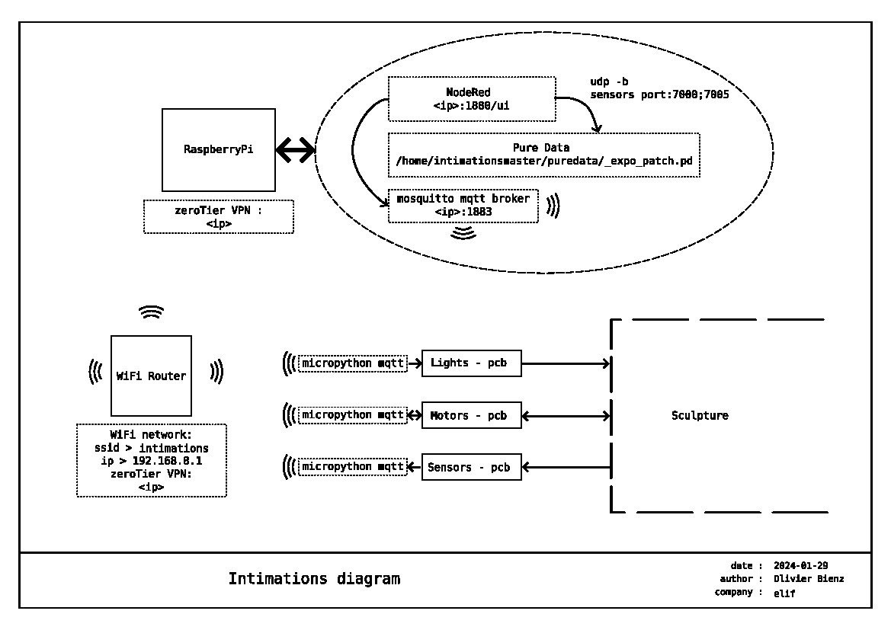
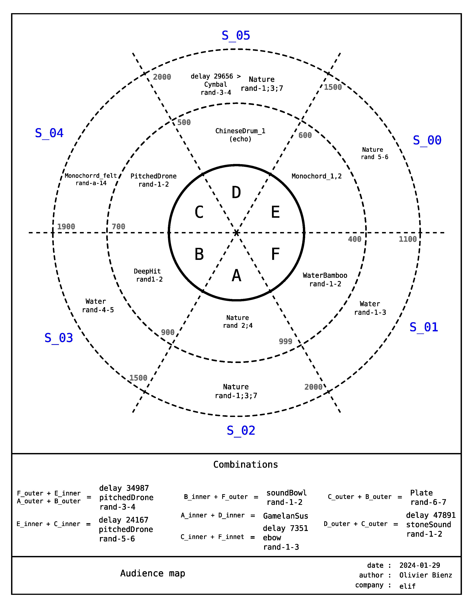
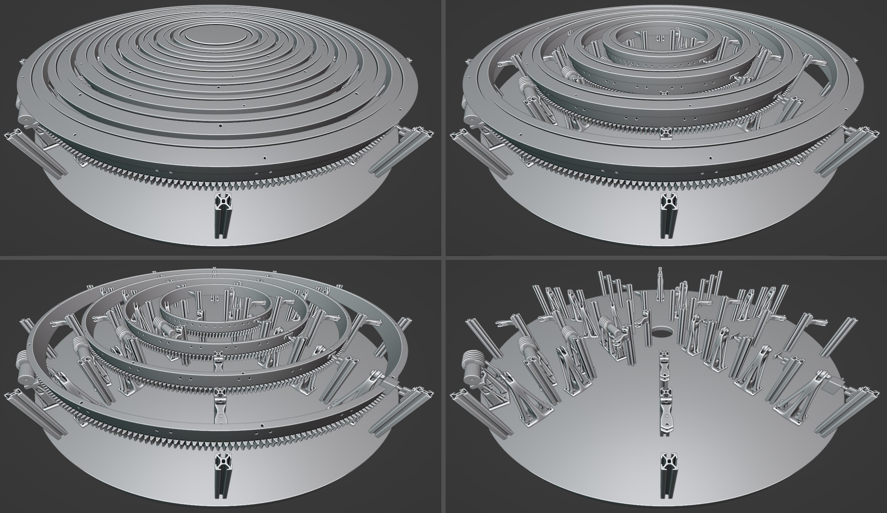

# Intimations

<!-- TOC -->
- [Installation](#installation)
  - [Raspberry](#raspberry)
    - [DAC+](#dac)
    - [NodeRed](#nodered)
    - [Pure Data](#pure-data)
    - [Mosquitto](#mosquitto)
- [How it works](#how-it-works)
  - [technical diagram](#technical-diagram)
  - [audience space mapping](#audience-space-mapping)
  - [mechanics](#mechanics)
  - [electronics](#electronics)
<!-- /TOC -->

## Installation

### Raspberry

#### DAC+

ref : https://www.raspberrypi.com/products/dac-plus/

* Install \
  Plug the shield on the RaspberryPi

`sudo nano /boot/config.txt --line`

l.6. > comment `#dtparam=i2c_arm=on`\
l.7. > enable `dtparam=i2s=on`\
l.8. > comment `#dtparam=spi=on`\
l.11 > comment `#dtparam=audio=on`\
l.12 > enable `dtoverlay=iqaudio-dac`\
l.27 > verify `dtoverlay=vc4-kms-v3d,noaudi` > (cut hdmi audio)

**All config file is in *dacplus/config.txt* folder**

#### NodeRed

* Install \
  [NodeRed](https://nodered.org/docs/getting-started/raspberrypi)
* Install dashboard \
  Palette > Install > *node-red-dashboard*

**The flow is available in the *nodered/flows.json* folder.**

#### Pure Data

* Install \\

```
sudo apt update && sudo apt upgrade -y

sudo apt install puredata -y
```

**The patch is available in the *puredata/_expo_patch.pd* folder.**

#### Mosquitto

* Install

```
sudo apt update && sudo apt upgrade -y

sudo apt install mosquitto mosquitto-clients -y

sudo systemctl enable mosquitto.service
```

* Edit config \
  `sudo nano /etc/mosquitto/mosquitto.conf`

add in the end :

```
listener 1883
allow_anonymous true
```

**Check the installation :**
* subscribe command line \
  `mosquitto_sub -d -t <topic>` (anonymous)\
  `mosquitto_sub -d -t <topic> -u <user> -P <pass>` (logged)
* publish command line \
  `mosquitto_pub -d -t <topic> -m "<Message>"` (anonymous)\
  `mosquitto_pub -d -t <topic> -m "<Message>" -u <user> -P <pass>` (logged)

## How it works

### network diagram



### audience space mapping



### mechanics



You can found all details and print parts in the *3d/* folder.

### electronics

**All firmeware available in *firmeware/< shield >* folder**\
**All shematics and gerber available in *pcb/mhk* folder in KiCad project format**

components :
- Motors Shield:
  - dagu WT751 (https://www.gotronic.fr/art-motoreducteur-wt751-17751.htm), motor 6Vcc
  - [drv8838](!https://www.pololu.com/product/2990), driver motor, 0→11V
  - [optical endstop](!https://www.amazon.fr/GeeekPi-Optical-Endstop-Photoelectric-imprimante/dp/B086P7XHJ2/ref=sr_1_7?__mk_fr_FR=%C3%85M%C3%85%C5%BD%C3%95%C3%91&crid=303ZPGFLA8E0W&keywords=optical+switch&qid=1706533943&sprefix=optical+switch%2Caps%2C99&sr=8-7)
  - [Rapsberry Pico Wifi](!https://www.raspberrypi.com/products/raspberry-pi-pico/), micropython

- Leds Shield:
  - WS2812 led strip, 5V
  - [Rapsberry Pico Wifi](!https://www.raspberrypi.com/products/raspberry-pi-pico/), micropython

- Sensors Shield:
  - [HC-SR04](!https://www.gotronic.fr/art-module-de-detection-us-hc-sr04-20912.htm), ultrasonic sensors
  - [Rapsberry Pico Wifi](!https://www.raspberrypi.com/products/raspberry-pi-pico/), micropython