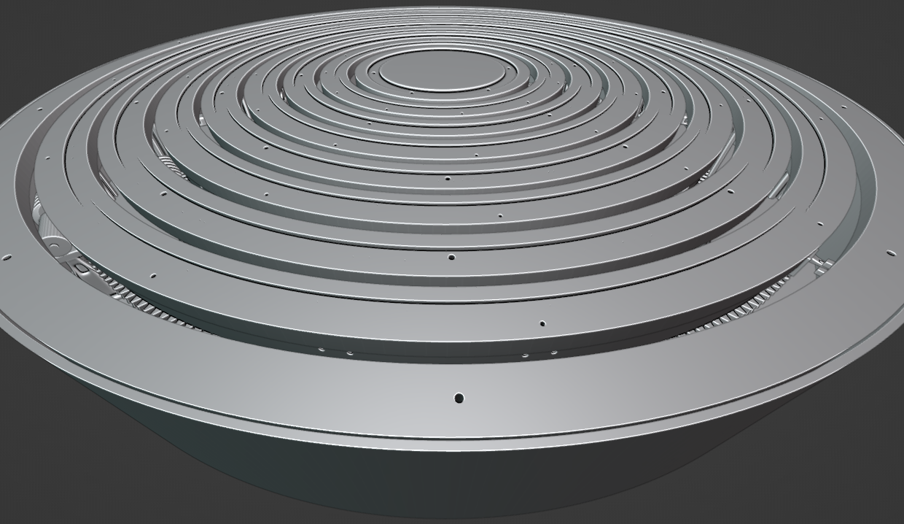

# Intimations of Shanshui

<!-- TOC -->
- [Interactive Sculpture](#interactive-sculpture)
  - [Interaction & Space Mapping Logic](#interaction--space-mapping-logic)
  - [network diagram](#network-diagram)
  - [mechanics](#mechanics)
  - [electronics](#electronics)
- [Installation](#installation)
  - [Raspberry](#raspberry)
    - [DAC+](#dac)
    - [NodeRed](#nodered)
    - [Pure Data](#pure-data)
    - [Mosquitto](#mosquitto)
<!-- /TOC -->

## Interactive Sculpture


|||
|--|--|
|Artists/Creators|Vivian Wang, Martin De Bie, Olivier Bienz|
|Title, Year|Intimations of Shanshui, 2024|
|Exhibition Location|Shanshui: Echoes & Signals, M+ Hong Kong|
|Media|Interactive textile sculpture with sound, light, movement, and sensors|
|Logic/Description|For Intimations, we created a structural concept around the idea of circular layers. This sculpture crafted from fabric creates a focused and immersive experience blending sound, movement, and light. Variations in sound, light and movement respond to human presence and circumnavigation, unfolding in a slow and deliberate choreography of the different elements. The work is an ode to Shanshui painting, bridging tradition and modernity through an interactive exchange and the composition of textile and sound, with special detail given to how lighting dramatically alters the visual impact of the mountains.|
|||

### Interaction & Space Mapping Logic

There are 6 distance sensors on the sculpture. They are labelled S_00 to S_05. S_02 and S_05 are at the entry and exit points of the display location called the Breakout Room. To trigger sound and light activity, we partitioned the interaction zones into 6 zones labelled A, B, C, D, E and F.

**Sounds** are activated by presence within zones. All zones have an inner and an outer zone and these measurements are not the same for each zone. The rationale is to have something a little more organic in shape. For example, Zone D has an inner zone that goes up to 500mm, and its outer zone extends up to 2000mm whereas Zone F has an inner zone of 400mm and the outer extends only up to 1100mm. Anything outside of 1100mm will register a value on the sensor but it will not trigger a sound. We also programmed sounds to trigger when 2 zones register a value at the same time, meaning the sensors in these zones have to sense two separate persons in order to activate a sound. Certain sounds will also only trigger after a delay value of say 29656ms in the outer zone of Zone D. This gives some nuance and variation to the sounds and does not create cacophony for every interaction that happens each time a sensor value is registered. These 2-zone combinations are also varied between inner and outer zones. For each specific zone within zones A-F, there are also sometimes 2 or 3 files that are randomised to create more diverse combinations of sounds.

**Light** colour combinations are also varied. Each concentric circle has between 3-5 sectors of LEDs that light up. The colour sectors are irregular, so as to create organic combinations of light and shadow play between the layers of textile. Different behaviours are triggered depending of how many zones are active during a certain amount of time. Each colour sequence is scripted to create a sense of rhythm and movement and the colours are selected according to a predefined colour palette.

**Movement** of the 4 circular rings/layers of textile mountains are programmed and follow its own logic. Between 90000ms to 120000ms, different combinations of rings 1,2,3 will move. The duration of movement varies between 3000ms and 20000ms. The direction of the oscillation is randomised. The rings could move in the same direction or in opposite directions. Once a day, all 4 rings move.


### network diagram


### mechanics

Principles assembly




You can find all details and print parts in the *3d/* folder.

### electronics

**All firmeware available in *firmeware/< shield >* folder**\
**All schematics and gerber available in *pcb/mhk* folder in KiCad project format**

components :
- Global:
  - Raspberry Pi
  - [DAC+](https://www.raspberrypi.com/products/dac-plus/)
  - [router](https://www.gl-inet.com/products/gl-b1300/), setup for zeroTier vpn support
  - [PowerSupply +5V](https://www.meanwell.fr/ac-dc-ultra-slim-din-rail-power-supply-input-range-hdr--30--5), for the Raspberry Pi and the shields
  - [PowerSupply +12V](https://www.meanwell.fr/ac-dc-ultra-slim-din-rail-power-supply-input-range-hdr--30--12), for the router

- Motors Shield:
  - [dagu WT751](https://www.gotronic.fr/art-motoreducteur-wt751-17751.htm), motor 6Vcc
  - [drv8838](https://www.pololu.com/product/2990), driver motor, 0→11V
  - [optical endstop](https://www.amazon.fr/GeeekPi-Optical-Endstop-Photoelectric-imprimante/dp/B086P7XHJ2/ref=sr_1_7?__mk_fr_FR=%C3%85M%C3%85%C5%BD%C3%95%C3%91&crid=303ZPGFLA8E0W&keywords=optical+switch&qid=1706533943&sprefix=optical+switch%2Caps%2C99&sr=8-7)
  - [Raspberry Pico Wifi](https://www.raspberrypi.com/products/raspberry-pi-pico/), micropython

- Leds Shield:
  - WS2812 led strip, 5V
  - [Raspberry Pico Wifi](https://www.raspberrypi.com/products/raspberry-pi-pico/), micropython

- Sensors Shield:
  - [HC-SR04](https://www.gotronic.fr/art-module-de-detection-us-hc-sr04-20912.htm), ultrasonic sensors
  - [Raspberry Pico Wifi](https://www.raspberrypi.com/products/raspberry-pi-pico/), micropython


**All details available in *pcb/mhk* KiCad project**


## Installation

### Raspberry

#### DAC+

[dac+](https://www.raspberrypi.com/products/dac-plus/)

* Install \
  Plug the shield on the RaspberryPi

`sudo nano /boot/config.txt --line`

l.6. > comment `#dtparam=i2c_arm=on`\
l.7. > enable `dtparam=i2s=on`\
l.8. > comment `#dtparam=spi=on`\
l.11 > comment `#dtparam=audio=on`\
l.12 > enable `dtoverlay=iqaudio-dac`\
l.27 > verify `dtoverlay=vc4-kms-v3d,noaudi` > (cut hdmi audio)

**All config files are in *dacplus/config.txt* folder**

#### NodeRed

* Install \
  [NodeRed](https://nodered.org/docs/getting-started/raspberrypi)
* Install dashboard \
  Palette > Install > *node-red-dashboard*

**The flow is available in the *nodered/flows.json* folder.**

#### Pure Data

* Install \

```
sudo apt update && sudo apt upgrade -y

sudo apt install puredata -y
```

**The patch is available in the *puredata/_expo_patch.pd* folder.**

#### Mosquitto

* Install

```
sudo apt update && sudo apt upgrade -y

sudo apt install mosquitto mosquitto-clients -y

sudo systemctl enable mosquitto.service
```

* Edit config \
  `sudo nano /etc/mosquitto/mosquitto.conf`

add in the end :

```
listener 1883
allow_anonymous true
```

**Check the installation :**
* subscribe command line \
  `mosquitto_sub -d -t <topic>` (anonymous)\
  `mosquitto_sub -d -t <topic> -u <user> -P <pass>` (logged)
* publish command line \
  `mosquitto_pub -d -t <topic> -m "<Message>"` (anonymous)\
  `mosquitto_pub -d -t <topic> -m "<Message>" -u <user> -P <pass>` (logged)